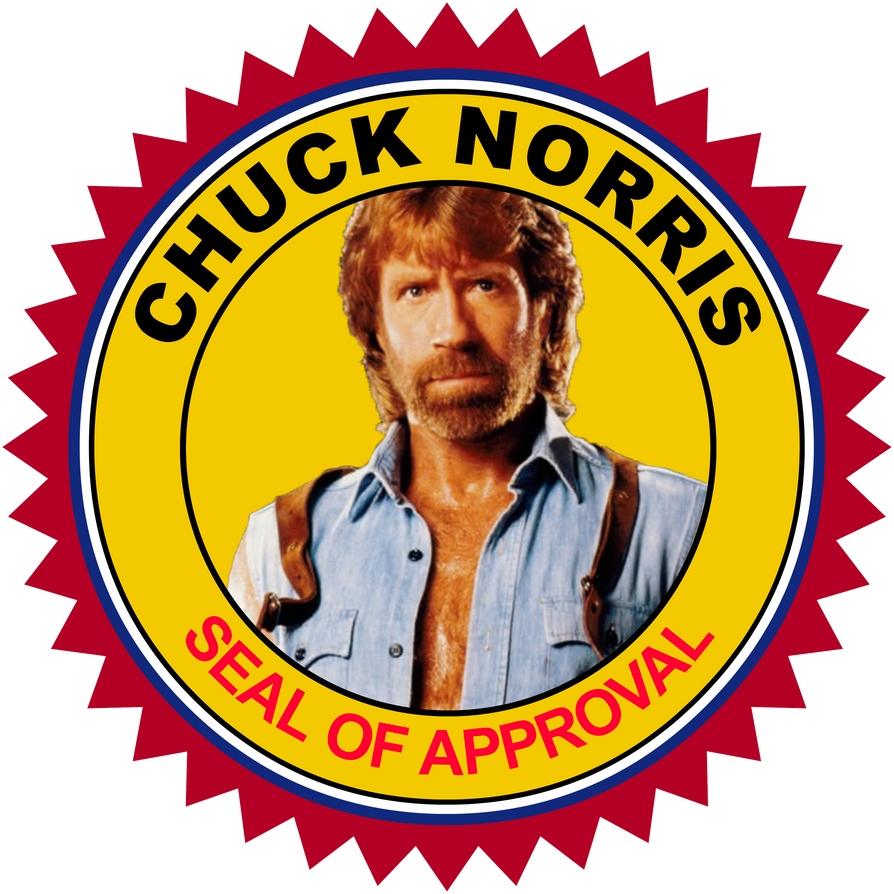

# Tarea de JSON con JAVA

**Deserialización de Objetos en Java con JSON**

La deserialización de objetos en Java con JSON es un proceso fundamental en el desarrollo de aplicaciones que involucra la conversión de datos en formato JSON a objetos Java, lo que permite manipular esos datos dentro del entorno de Java de manera eficiente y estructurada. Este proceso es especialmente útil cuando se trabaja con servicios web o sistemas que intercambian datos en formato JSON.

En Java, la deserialización de JSON a objetos Java se realiza típicamente utilizando bibliotecas como Gson o Jackson, que ofrecen herramientas poderosas para manejar este tipo de operaciones de manera flexible y efectiva.

El proceso de deserialización implica los siguientes pasos:

1. **Definición de la estructura del objeto Java**: Antes de que puedas deserializar datos JSON en objetos Java, es esencial definir la estructura de los objetos Java que recibirán esos datos. Esto se logra mediante la creación de clases Java con campos que correspondan a los datos que se espera recibir del JSON.

2. **Uso de la biblioteca de deserialización**: Una vez que la estructura del objeto Java está definida, puedes utilizar la biblioteca de deserialización correspondiente para convertir los datos JSON en objetos Java. Esto se hace típicamente invocando métodos proporcionados por la biblioteca, como `fromJson()` en Gson o `readValue()` en Jackson, pasando la cadena JSON y el tipo de objeto Java esperado como argumentos.

3. **Manipulación de los objetos Java resultantes**: Después de la deserialización, obtienes objetos Java que contienen los datos previamente codificados en JSON. Puedes manipular estos objetos de la misma manera que cualquier otro objeto Java, lo que te permite acceder y utilizar los datos de manera conveniente en tu aplicación.

4. **Manejo de excepciones (opcional)**: Es importante tener en cuenta que el proceso de deserialización puede generar excepciones, como errores de formato JSON o incompatibilidades entre la estructura del JSON y la estructura del objeto Java. Por lo tanto, es recomendable manejar adecuadamente estas excepciones en tu código para garantizar un comportamiento robusto y confiable de tu aplicación.

En resumen, la deserialización de objetos en Java con JSON es un proceso esencial para trabajar con datos JSON en el entorno de Java. Con bibliotecas como Gson y Jackson, este proceso se vuelve accesible y eficiente, permitiéndote integrar fácilmente datos JSON en tu aplicación Java y aprovechar todo su potencial en términos de interoperabilidad y compatibilidad.

Para Práticar 

## PARTE 1: Chistes de ChuckNorries

https://www.deviantart.com/jigaraphale/art/Chuck-Norris-Seal-Of-Approval-776993923

> ## Empieza investigando como fuciona la API de Chuck
>
> * **API de Chuck Norris:** [https://api.chucknorris.io/](https://api.chucknorris.io/)

A partir de una petición dede java a esta API obtendrás un JSON. Tendrás que preparar una clase en java para almacenar los objetos a partir de des deserialización. Para llevar a cabo este proceso utilizaremos la libreria de google gson. https://javadoc.io/doc/com.google.code.gson/gson/latest/com.google.gson/module-summary.html

## Ampliación 

Antes de procesar el json lo validaremos con un esquema
https://json-schema.org/
  
En este enlace tienes un ejemplo sencillo de como hacerlo. 
https://json-schema.org/learn/getting-started-step-by-step

